# Flutter 설치하기

## 공식 홈페이지

한글: [https://flutter-ko.dev/docs/get-started/install](https://flutter-ko.dev/docs/get-started/install)

영어: [https://docs.flutter.dev/get-started/install](https://docs.flutter.dev/get-started/install)

## OS에 따라 설치 진행

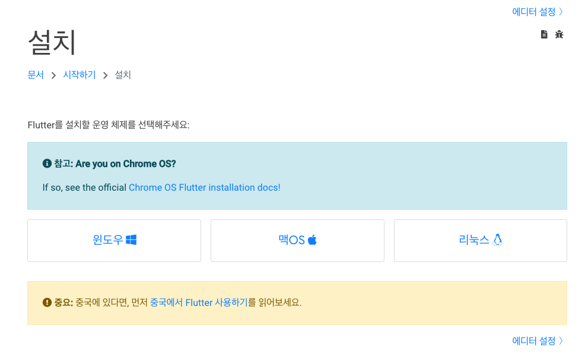

<aside>
💡 한글 페이지에서 다운로드 기능이 정상 동작하지 않는 경우가 있습니다

</aside>

### 맥OS

`zip 파일`을 다운로드하여 설치하는 방법과 `brew` 를 사용하는 방법이 있습니다.

**brew를 통한 설치**

`brew install flutter`

**zip 파일을 다운로드 받아 직접 설치**


다운로드가 완료되면 unzip 후 rc파일에 SDK 경로를 설정합니다.

```bash
unzip ~/Downloads/flutter_macos_2.10.3-stable.zip
vi ~/.zshrc 
# export PATH**=**"$PATH:{install_path}/flutter/bin" 추가
```

### Windows

`zip 파일`을 다운로드하여 설치를 진행합니다.

압축을 해제하면 `flutter_console.bat` 파일을 확인할 수 있는데 해당 파일을 실행하여 명령어를 입력하거나, 기본 터미널을 사용하고 싶은 경우 환경 변수를 설정해줍니다.

- PATH에 경로 추가 `/{설치경로}/flutter/bin`

## flutter doctor

플러터 설치를 돕는 명령어입니다. 명령어를 실행하면 아래와 같은 내용을을 확인할 수 있습니다.

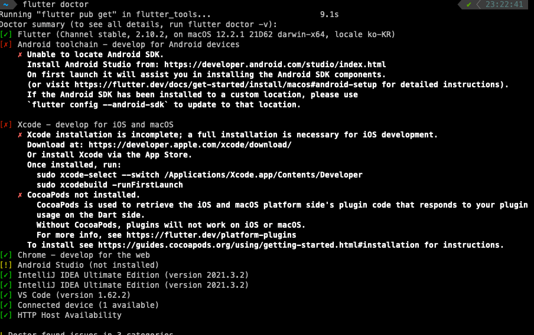

설치 과정이 완료되지 않은 경우 출력된 내용을 확인하여 추가적인 명령어를 실행하면 설치를 완료할 수 있습니다.

## iOS 관련 설치

### Xcode 설치

<aside>
💡 windows는 iOS 개발 관련된 도구를 설치할 수 없습니다.

</aside>

App Store 또는 [공식 홈페이지](https://developer.apple.com/kr/xcode/)를 통해 Xcode를 설치합니다.

설치가 완료되면 아래 명령어를 입력해 설치를 완료합니다.

```bash
sudo xcode-select --switch /Applications/Xcode.app/Contents/Developer
sudo xcodebuild -runFirstLaunch
```

### iOS simulator

```java
open -a Simulator
```


시뮬레이터가 정상 실행되는지 확인합니다. 

기본적인 설정은 적용되어 있으나 추가적인 설정이 필요한 경우 [홈페이지의 가이드](https://docs.flutter.dev/get-started/install/macos#set-up-the-ios-simulator)를 따라 설정합니다.

- 5s이상의 기기를 사용하는지, 화면 크기가 적당한지 확인

### flutter 앱 실행해보기

플러터 앱을 생성하고 실행하는 명령어입니다. siumulator에 플러터 앱이 실행되는 것을 확인할 수 있습니다.

```bash
flutter create my_app
cd my_app
flutter run
```

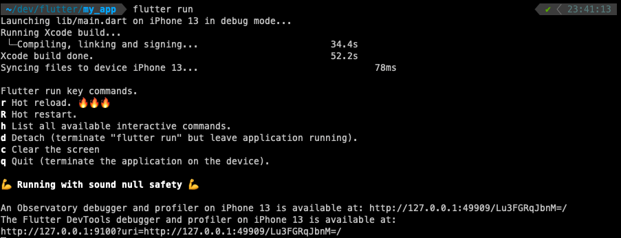

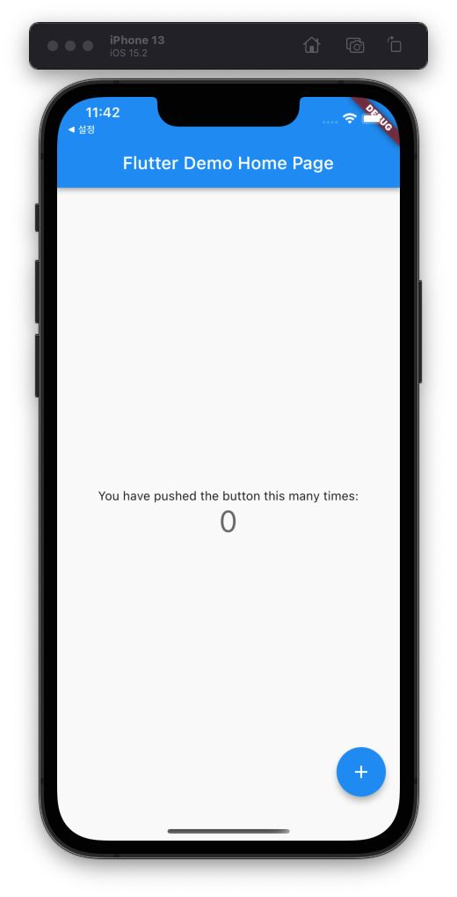

<aside>
💡 iOS 기기에 배포는 작성하지 않았습니다.
참고: [https://docs.flutter.dev/get-started/install/macos#deploy-to-ios-devices](https://docs.flutter.dev/get-started/install/macos#deploy-to-ios-devices)

</aside>

## Android 관련 설치

### Android Studio 설치

[JetBrains toolbox](https://www.jetbrains.com/toolbox-app/) 또는 [공식 홈페이지](https://developer.android.com/studio)를 통해 설치를 진행합니다.

기본 경로에 설치를 진행하지 않았다면 flutter doctor를 실행하여 Flutter가 정상적으로 안드로이드 스튜디오를 인식하는지 확인해야 합니다.

**문제가 발생하는 경우** 아래 명령어를 통해 설정을 진행합니다.

```bash
flutter config --android-studio-dir <directory>
```

### Virtual Device Manager에서 안드로이드 기기 생성

Virtual Device Manager에서 안드로이드 기기를 관리합니다. 

공식 홈페이지에서는 `AVD Manager` 로 표기되고 있습니다.

상단 바의 `Tools` 에서 찾을 수 있으며 프로젝트 생성 전에는 More Actions를 클릭하면 확인할 수 있습니다.

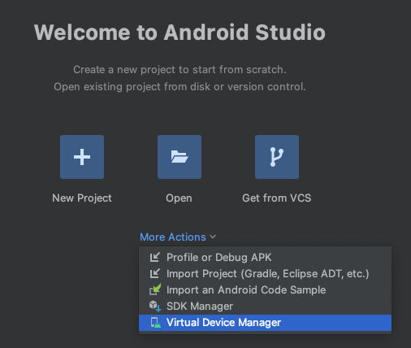

Create device를 클릭하여 원하는 기기와 이미지를 선택할 수 있습니다.


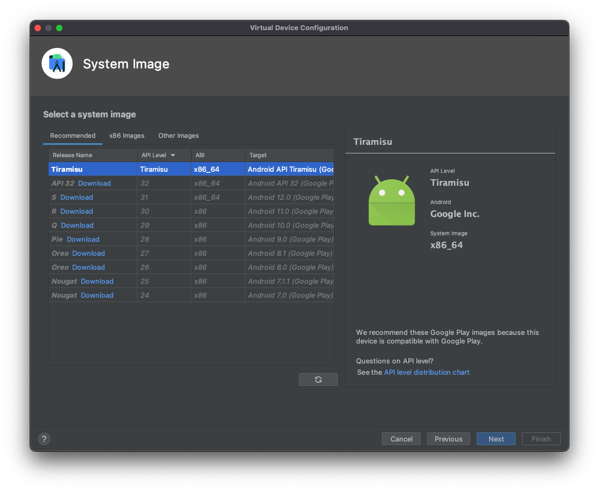

Next를 눌러 안드로이드 가상 기기 생성을 완료합니다.

<aside>
💡 하드웨어 가속 설정 관련 부분은 홈페이지 가이드 참고
[https://docs.flutter.dev/get-started/install/windows#set-up-the-android-emulator](https://docs.flutter.dev/get-started/install/windows#set-up-the-android-emulator)

</aside>

### SDK Manager 설정

안드로이드 스튜디오 설정(cmd + ,) 페이지 진입 후 

Appearence & Behavior - System Settings - Android SDK 항목의 `SDK Tools` 탭에서 Android SDK Command-line Tools 설치를 진행합니다.

- 체크박스를 선택한 후 apply를 누르면 설치가 진행됩니다.

정상적으로 설정이 적용되었는지 확인하려면 `flutter doctor` 명령어를 실행합니다.


라이센스에 동의하면 노란불도 없앨 수 있습니다

- `flutter doctor --android-licenses`

설정을 완료했음에도 아래와 같은 에러가 나온다면 안드로이드 SDK 경로를 찾지 못했을 수 있습니다.


참고 링크를 확인하여 에러를 해결합니다.

- [https://stackoverflow.com/questions/68236007/i-am-getting-error-cmdline-tools-component-is-missing-after-installing-flutter](https://stackoverflow.com/questions/68236007/i-am-getting-error-cmdline-tools-component-is-missing-after-installing-flutter)
- [https://blog.naver.com/PostView.naver?blogId=chandong83&logNo=222523368305](https://blog.naver.com/PostView.naver?blogId=chandong83&logNo=222523368305)

### flutter 플러그인 설치

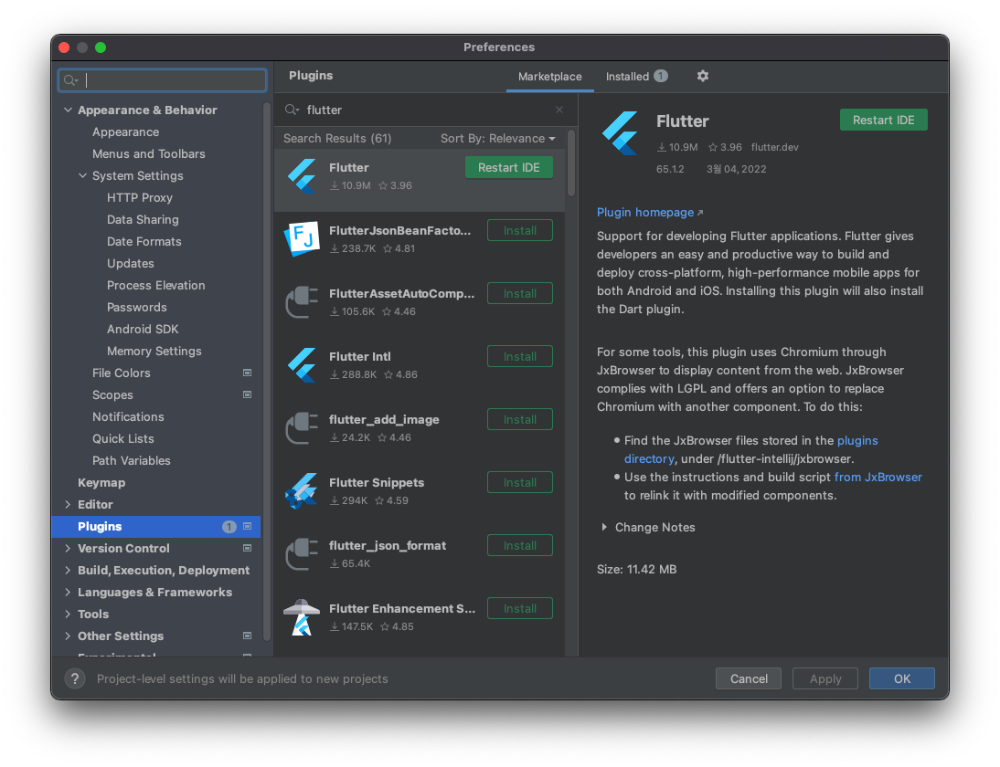

설정(cmd + ,) - plugins의 `marketplace` 탭에서 flutter 플러그인을 설치합니다.

## flutter 프로젝트 생성하고 실행하기

New Flutter Project를 통해 프로젝트를 생성할 수 있습니다.

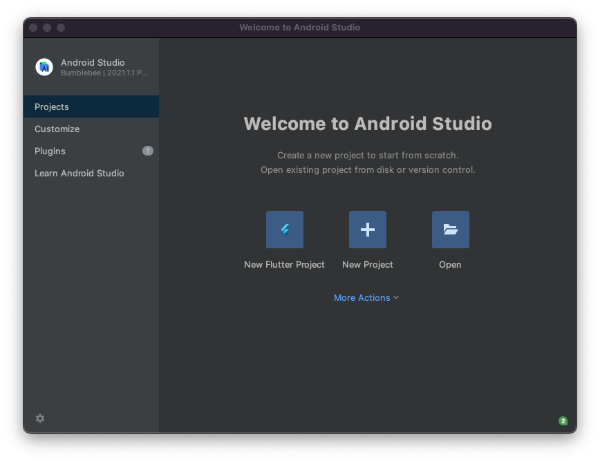

좌측 메뉴 중 Flutter를 선택한 후 진행합니다.

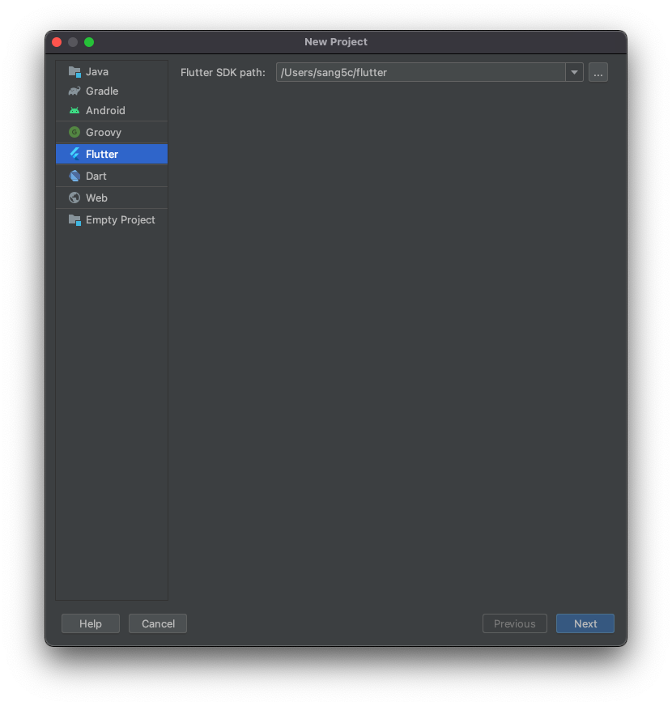

프로젝트명은 lowercase + underscore로 구성해야 합니다. 

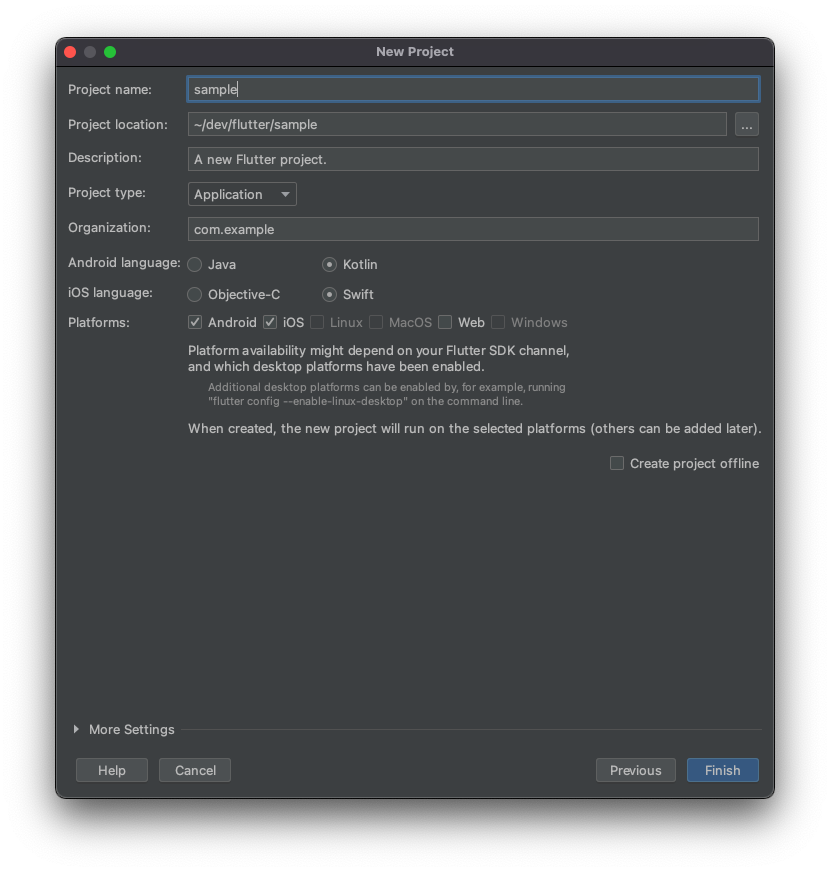

프로젝트 생성을 완료한 후 프로젝트에서 사용할 기기를 선택합니다.

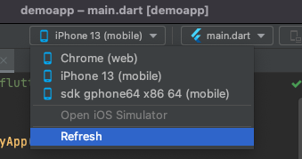

안드로이드 기기가 뜨지 않으면 상단바 Tools - Device manager에서 안드로이드 기기를 실행하여 확인 가능합니다.

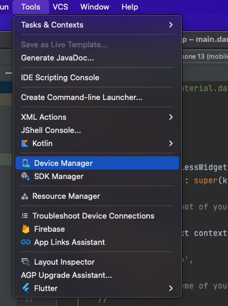

이후 Run 버튼을 누르면 선택한 기기에서 작성한 프로그램이 실행됩니다.


## 자동 코드 포맷팅 설정

Android Studio > Preferences > Tools > File Watchers > Add 에서 아래와 같이 설정하면 소스코드를 저장할때 자동으로 코드 포맷팅이 적용됩니다.

